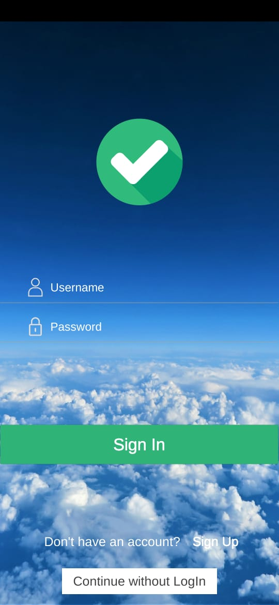
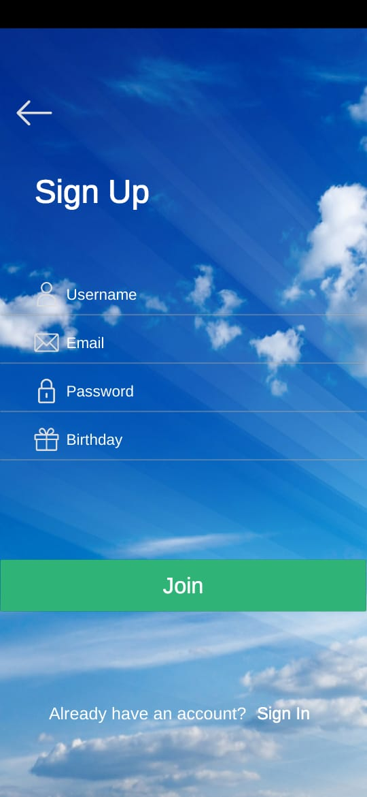

# Reusable-UI-System

This is a Reusable UI system with modular design where scene(s) can be added on the go with all the components required for a scene to make transitions. All the animation clip files are included with animation controllers and override animation controllers. This is an Unity project and can be used for any platform with minor changes in canvas renderer and canvas size. 

# link to APK file of the build: https://github.com/SKY-ROY/Reusable-UI-System/raw/master/BUILD/RUIS%5B0.1%5D.apk
# link to Project package: https://github.com/SKY-ROY/Reusable-UI-System/raw/master/CloningPackage/RUIS%5B0.1%5D.unitypackage

# NOTE
All the files present in this github repository(other than the "BUILD" & "CloningPackage" folders) are sufficient to clone the project in your target machine, with all the settings matching the parent machine. The only folder missing here in this repository is the "library" folder which contains the pre built packages and settings by Unity. When you load the folder with all contents of this repository("BUILD" & "CloningPackage" folders not necessary) as a project in Unity, Unity will generate the "library" folder itself to clone the project with parent machine's settings.

# Screenshots
 

 

